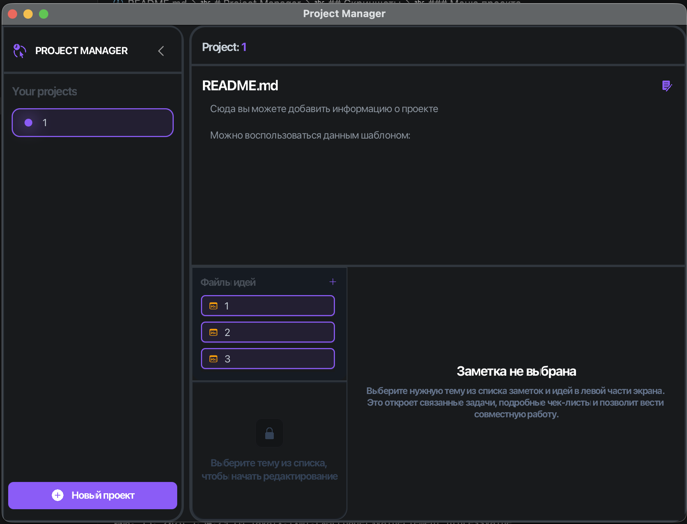
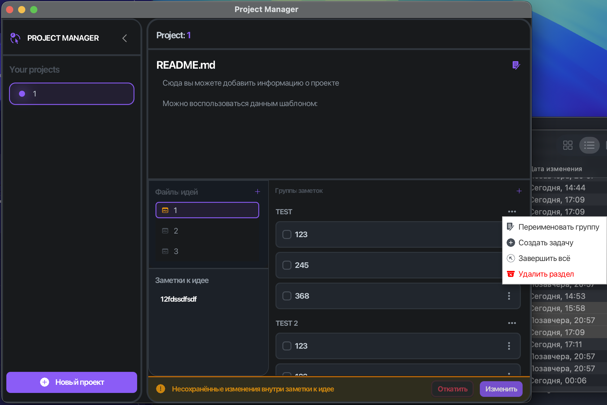
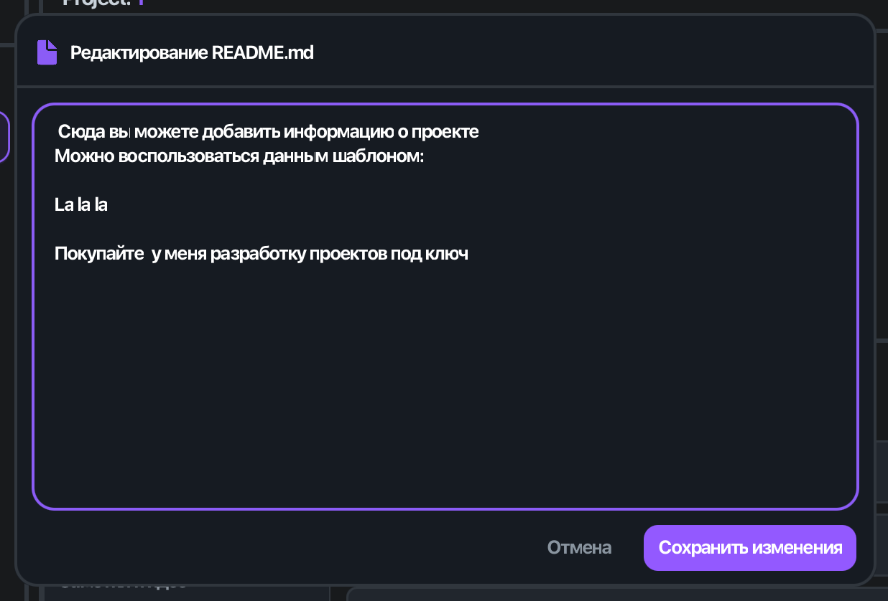

# Project Manager


> Project Manager - десктопное JavaFX-приложение для ведения проектов, задач, идей и заметок в одном месте. Оно помогает структурировать работу по проектам, привязывать идеи к задачам, редактировать README проекта и хранить данные в локальной файловой системе.

## Содержание

- [О проекте](#о-проекте)
- [Возможности](#возможности)
- [Скриншоты](#скриншоты)
- [Установка и запуск](#установка-и-запуск)
- [Настройка](#настройка)
- [Структура проекта](#структура-проекта)
- [Лицензия](#лицензия)

## О проекте

Project Manager предназначен для организации работы над несколькими проектами одновременно. Внутри каждого проекта можно хранить README, идеи и задачи, а также быстро переключаться между разделами через интерфейс на JavaFX.

Приложение находится в активной разработке. Основной сценарий уже заложен: отображение списка проектов, открытие проекта, работа с идеями и задачами, редактирование README и хранение данных на диске.

## Возможности

- Список проектов с созданием и удалением проектов.
- Главное окно на `BorderPane` с загрузкой отдельных панелей в разные области интерфейса.
- Модуль README для просмотра и редактирования описания проекта.
- Модуль идей с файлами, связанными с задачами.
- Модуль задач со структурой разделов и статусов выполнения.
- Локальное хранение данных в файловой системе проекта.
- Подготовка к пакетированию через `jlink` и `jpackage`.

## Скриншоты

### Главное меню




### Меню задач



### Меню изменения README.md



## Установка и запуск

1. Убедитесь, что установлен JDK 21 или новее.
2. Соберите и запустите приложение через Gradle:

```bash
./gradlew run
```

3. Для сборки дистрибутива используйте задачи Gradle, связанные с `jlink` и `jpackage`, если они нужны для вашего сценария распространения.

## Настройка

Проект использует JavaFX, Guava и Jackson. Основные зависимости и точка входа заданы в [app/build.gradle](app/build.gradle) и [app/src/main/java/mryazik/github/io/App.java](app/src/main/java/mryazik/github/io/App.java).

Ключевые технические детали:

- `mainClass` - `mryazik.github.io.App`.
- Java toolchain - 21.
- JavaFX модули - `javafx.controls`, `javafx.fxml`, `javafx.graphics`.
- Хранение данных - локальные файлы и JSON.

## Структура проекта

- [app/src/main/java/mryazik/github/io/App.java](app/src/main/java/mryazik/github/io/App.java) - точка входа приложения.
- [app/src/main/java/mryazik/github/io/Controllers/](app/src/main/java/mryazik/github/io/Controllers/) - контроллеры интерфейса.
- [app/src/main/java/mryazik/github/io/Classes/](app/src/main/java/mryazik/github/io/Classes/) - вспомогательные классы для загрузки и работы с окнами.
- [app/src/main/java/mryazik/github/io/workData/](app/src/main/java/mryazik/github/io/workData/) - модели и логика работы с проектами, задачами и идеями.
- [app/src/main/resources/mryazik/github/io/](app/src/main/resources/mryazik/github/io/) - FXML, иконки и другие ресурсы интерфейса.
- [app/src/main/java/module-info.java](app/src/main/java/module-info.java) - описание модулей Java.

## Лицензия

Проект распространяется под лицензией Apache 2.0. Подробности — в файле [LICENSE](LICENSE).
